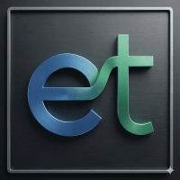
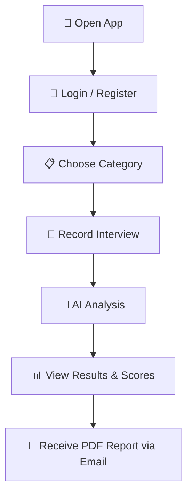
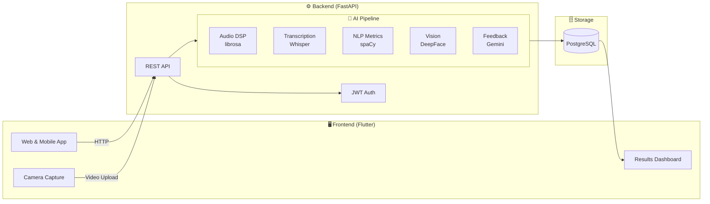

<div align="center">
  
  <h1>Entrevista't</h1>

  <p>
    Plataforma de preparació d'entrevistes amb IA
  </p>

  <p>
    
    
    
    
    
    
    
  </p>
</div>

<br />

---

## About

**Entrevista't** is an AI-powered interview practice platform. Users pick a job category, answer timed questions on camera, and receive automated feedback with scores across audio, text, and emotional dimensions — plus a personalized PDF report delivered via email.

All user-facing text is in **Catalan (Català)**. Code, comments, and documentation are in English.

> 🌐 **Live at** [entrevistat.kire.ovh](https://entrevistat.kire.ovh)

---

## Project Aim

**Entrevista't** is a PTI (Projecte de Tecnologies de la Informació) — an academic capstone project from a university IT engineering degree. The goal is to design and deliver a complete, production-ready platform that helps students and job-seekers improve their interview skills through AI-driven feedback.

The project brings together several engineering disciplines in a single product: cross-platform web and mobile development with Flutter, a Python backend with REST APIs and database persistence, and a multi-model AI pipeline covering audio signal processing, natural language understanding, computer vision, and large-language-model feedback generation.

The platform evaluates candidates across multiple dimensions — speech patterns, content quality, and facial emotion — using state-of-the-art models (Whisper, spaCy, DeepFace, Gemini). Results are presented as interactive charts and a downloadable PDF report with personalized improvement tips.

Beyond the academic period, Entrevista't serves as a portfolio project that demonstrates end-to-end system design, from cloud deployment and CI/CD to ML inference pipelines and responsive UI.

---

## How It Works



The platform evaluates candidates across three dimensions:

- 🎙️ **Audio** — speech duration, pause patterns, communication rhythm (WPM)
- 📝 **Text** — question alignment, coherence, information density, lexical richness, confidence index
- 😊 **Video** — emotion distribution, dominant emotion, emotional stability via face analysis
- 🤖 **LLM** — personalized qualitative feedback and improvement tips (Gemini 2.5 Flash)

---

## Repositories

| Repository | Description | Stack |
|------------|-------------|-------|
| [**Front**](https://github.com/Entrevista-t/Front) | Web & mobile client — camera capture, results dashboard, PDF reports | Flutter 3.27 · Dart · GoRouter · Docker |
| [**Back**](https://github.com/Entrevista-t/Back) | API server & AI analysis pipeline — transcription, NLP, emotion detection, LLM feedback | FastAPI · Python 3.12 · Whisper · spaCy · DeepFace · Gemini · PostgreSQL |

---

## Architecture Overview



---

## Tech Stack

| Layer | Technology |
|-------|-----------|
| **Frontend** | Flutter 3.27 · Dart 3.6 · GoRouter · fl_chart · camera plugin |
| **Backend** | FastAPI · Uvicorn · Pydantic · SQLAlchemy 2.0 |
| **Database** | PostgreSQL (JSONB for metrics) |
| **Auth** | JWT (PyJWT) · bcrypt (passlib) |
| **AI — Audio** | OpenAI Whisper · librosa · ffmpeg |
| **AI — NLP** | spaCy (`ca_core_news_md`) · SentenceTransformers · scikit-learn |
| **AI — Vision** | MediaPipe FaceMesh · DeepFace |
| **AI — LLM** | Google Gemini 2.5 Flash (personalized feedback) |
| **Infra** | Docker · GitHub Actions · Docker Swarm · GHCR |

---

## Getting Started

Each repo has its own detailed README with full setup instructions. Both include interactive launcher scripts (`start.ps1` / `start.sh`) and Docker Compose configs.

```bash
# Clone both repos
git clone https://github.com/Entrevista-t/Back.git
git clone https://github.com/Entrevista-t/Front.git

# Backend (http://localhost:8000)
cd Back && cp .env.example .env   # configure DATABASE_URL
./start.ps1                        # interactive launcher

# Frontend (http://localhost:8080)
cd ../Front
./start.ps1                        # interactive launcher
```

---

## Disclaimer

This project is under active development as part of an academic initiative. Features and APIs may change without notice.

---

## License

No formal license has been declared yet. Please contact the maintainers for usage permissions.
